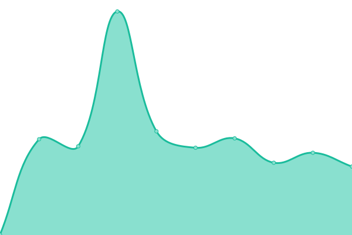

# [📈 Live Status](https://Allovue.github.io/upptime): <!--live status--> **🟧 Partial outage**

This repository contains the open-source uptime monitor and status page for [Allovue](https://Allovue.github.io/upptime), powered by [Upptime](https://github.com/upptime/upptime).

With [Upptime](https://upptime.js.org), you can get your own unlimited and free uptime monitor and status page, powered entirely by a GitHub repository. We use [Issues](https://github.com/Allovue/upptime/issues) as incident reports, [Actions](https://github.com/Allovue/upptime/actions) as uptime monitors, and [Pages](https://Allovue.github.io/upptime) for the status page.

<!--start: status pages-->
<!-- This summary is generated by Upptime (https://github.com/upptime/upptime) -->
<!-- Do not edit this manually, your changes will be overwritten -->
<!-- prettier-ignore -->
| URL | Status | History | Response Time | Uptime |
| --- | ------ | ------- | ------------- | ------ |
|  [Allovue Login URL](https://loginredirect.allovue.com/login_redirect) | 🟩 Up | [allovue-login-url.yml](https://github.com/Allovue/upptime/commits/HEAD/history/allovue-login-url.yml) | 

 265ms
     
 | 

<a href="https://Allovue.github.io/upptime/history/allovue-login-url">100.00%</a>
    

|  [Manage Classic](https://demo.allovue.com) | 🟩 Up | [manage-classic.yml](https://github.com/Allovue/upptime/commits/HEAD/history/manage-classic.yml) | 

 298ms
     
 | 

<a href="https://Allovue.github.io/upptime/history/manage-classic">100.00%</a>
    

|  [New Manage](https://allovue.app/healthcheck) | 🟥 Down | [new-manage.yml](https://github.com/Allovue/upptime/commits/HEAD/history/new-manage.yml) | 

 312ms
     
 | 

<a href="https://Allovue.github.io/upptime/history/new-manage">99.25%</a>
    

|  [Allocate](https://allocate.allovue.com/healthcheck) | 🟩 Up | [allocate.yml](https://github.com/Allovue/upptime/commits/HEAD/history/allocate.yml) | 

 1527ms
     
 | 

<a href="https://Allovue.github.io/upptime/history/allocate">99.86%</a>
    

<!--end: status pages-->

[**Visit our status website →**](https://Allovue.github.io/upptime)

## 📄 License

- Powered by: [Upptime](https://github.com/upptime/upptime)
- Code: [MIT](./LICENSE) © [Allovue](https://Allovue.github.io/upptime)
- Data in the `./history` directory: [Open Database License](https://opendatacommons.org/licenses/odbl/1-0/)
